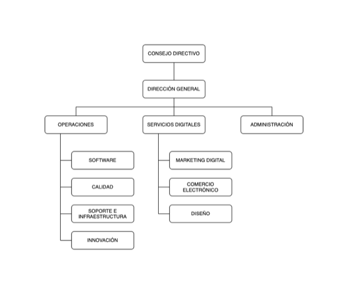

###

## Datos generales de la Empresa

### Nombre 
Virtua

### Descripción
Virtua MX es una agencia digital establecida en Durango, dedicada a brindar servicios en Tecnologías de la Información. Especializada en el diseño de estrategias que permitan a las empresas aprovechar las tecnologías para la mejora de sus procesos y sobre todo la atención a sus clientes, buscando con ello traducirlo en un crecimiento real de la misma. Nos especializamos en Desarrollo de Software, e-Commerce y Marketing Digital.

### Servicios
Consultoría.  
Desarrollo de software.  
Marketing digital.  
e-Commerce.  
Diseño. 

### Certificaciones
Scrum Developer by Scrum Alliance.  
Scrum Master by Scrum Alliance.  
Scrum Product Owner by Scrum Alliance.  
ISO/IEC 29110 Ingeniería de Software (En proceso).  

### Misión
Brindar soluciones creativas y de alta tecnología de información a nuestros clientes, colaborando en el éxito de sus estrategias de negocio.

### Visión
Ser una empresa referente en el mercado global, que brinde a sus clientes soluciones digitales, innovadoras y de calidad, en un marco de armonía y compromiso con sus valores, su equipo, la sociedad y el medio ambiente.

### Historia
Fue fundada en Noviembre de 2010 por Tao Rivera y Miguel Ramírez, con el objetivo de impulsar la transformación digital de las empresas y el desarrollo tecnológico de nuestra región. Con ese objetivo, durante casi 10 años se ha colaborado con cientos de empresas a través del desarrollo de proyectos de software o la prestación de servicios digitales, desde un sitio web o tienda en línea, servicios de marketing digital, hasta desarrollo de aplicaciones móviles o robustas plataformas de gestión empresarial.

### Fundación
1 de noviembre de 2010

### Director General
ISC. Tao Rivera Morales

### Giro de la empresa
Servicios

### Tamaño
Micro empresa

### Número de colaboradores
7 

### Organigrama

### Razón Social
JOSE MIGUEL ARMANDO RAMIREZ MORALES

### RFC
RAMM810719SW3

### Domicilio
[Valle de Guatimapé 402 Col. Esperanza. CP 34080 Durango, Dgo., México.](https://www.google.com.mx/maps/place/VirtuaMX/@24.0340039,-104.6518873,15z/data=!4m5!3m4!1s0x0:0x38b38a4e1dd0ff91!8m2!3d24.0340039!4d-104.6518873?sa=X&ved=0ahUKEwji3-6Fl6fZAhUB_2MKHU-jAqEQ_BIIgQEwDg)

### Teléfono
6181950467

### Teléfono
3334021574

### Correo
contacto@virtua.mx

### Página Web
[www.virtua.mx](http://www.virtua.mx)
